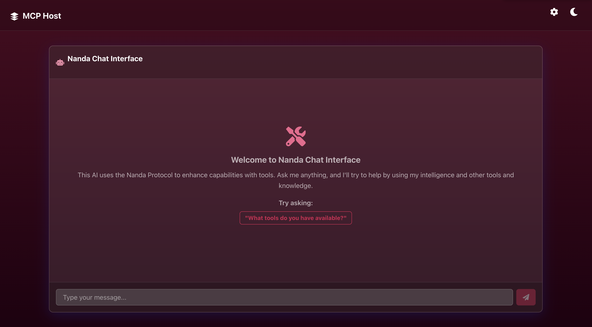

# MCP Host

MCP Host is a complete end-to-end implementation of a Model Context Protocol (MCP) host with an in-built MCP client. It provides a polished chat interface with built-in tool selection via the Model Context Protocol (MCP).



## Features

- **Chat Interface**: A modern UI with a glassmorphism design and crimson theme
- **MCP Client Integration**: Discover and use tools from MCP servers
- **Anthropic API Integration**: Powered by Claude, one of the most capable AI assistants
- **Server-Side Processing**: Backend handles communication with Anthropic and MCP servers
- **Docker Support**: Easy local deployment with Docker

## Getting Started

### Prerequisites

- [Docker](https://docs.docker.com/get-docker/) and [Docker Compose](https://docs.docker.com/compose/install/)
- An [Anthropic API key](https://console.anthropic.com/)

### Running with Docker

1. Clone the repository:

   ```bash
   git clone https://github.com/yourusername/mcp-host.git
   cd mcp-host
   ```

2. Start the application with Docker Compose:

   ```bash
   docker-compose up -d
   ```

3. Access the application at [http://localhost:3000](http://localhost:3000)

4. In the app, click the gear icon to open settings and enter your Anthropic API key

### Development Setup

If you want to run the application in development mode:

#### Server

```bash
cd server
npm install
npm run dev
```

#### Client

```bash
cd client
npm install
npm start
```

## Configuring MCP Servers

MCP Host can connect to multiple MCP servers using Server-Sent Events (SSE). To add a server:

1. Open the application and click the gear icon to access settings
2. Go to the "MCP Servers" tab
3. Fill in the server details:
   - **Server ID**: A unique identifier for the server
   - **Server Name**: A human-readable name
   - **Server URL**: The SSE endpoint URL of the MCP server (e.g., `http://localhost:3001/sse`)
4. Click "Add Server"

### Example MCP Server Setup

Here's an example of how to set up an MCP server with SSE transport that's compatible with MCP Host:

```typescript
import { McpServer } from "@modelcontextprotocol/sdk/server/mcp.js";
import { SSEServerTransport } from "@modelcontextprotocol/sdk/server/sse.js";
import express from "express";
import { z } from "zod";

// Create an MCP server
const server = new McpServer({
  name: "MyServer",
  version: "1.0.0",
});

// Add your tools
server.tool("my-tool", { param: z.string() }, async ({ param }) => ({
  content: [{ type: "text", text: `You sent: ${param}` }],
}));

// Set up Express app
const app = express();
const port = 3001;

// To support multiple simultaneous connections, a session-based lookup object is used
const transports: { [sessionId: string]: SSEServerTransport } = {};

// SSE endpoint
app.get("/sse", async (_, res) => {
  const transport = new SSEServerTransport("/messages", res);
  transports[transport.sessionId] = transport;

  res.on("close", () => {
    delete transports[transport.sessionId];
  });

  await server.connect(transport);
});

// Message handling endpoint
app.post("/messages", async (req, res) => {
  const sessionId = req.query.sessionId as string;
  const transport = transports[sessionId];

  if (transport) {
    await transport.handlePostMessage(req, res);
  } else {
    res.status(400).send("No transport found for sessionId");
  }
});

// Start the server
app.listen(port, () => {
  console.log(`MCP server running on http://localhost:${port}`);
});
```

You can then add this server to MCP Host using the URL `http://localhost:3001/sse`.

## Architecture

MCP Host consists of:

- **Frontend**: React application with Chakra UI
- **Backend**: Node.js server with Express
- **MCP Client**: Integrated client using the official MCP SDK with SSE transport

The application follows a clean architecture pattern with separation of concerns:

- **Client**: UI components, contexts for state management
- **Server**: API endpoints, MCP integration, tool execution
- **Shared**: Common types used by both client and server

### Communication Protocol

MCP Host uses Server-Sent Events (SSE) for communication with MCP servers. This approach offers several advantages:

1. **Web Compatibility**: SSE works over standard HTTP, making it compatible with web servers and accessible over networks
2. **No File System Access Required**: Unlike stdio transport, SSE doesn't require access to the local file system
3. **Multiple Connections**: Supports connections to multiple MCP servers simultaneously
4. **Docker Friendly**: Works well in containerized environments since it doesn't rely on process spawning

## License

This project is licensed under the MIT License - see the LICENSE file for details.

## Acknowledgements

- [Model Context Protocol](https://modelcontextprotocol.io/) for the MCP standard
- [Anthropic](https://www.anthropic.com/) for the Claude AI assistant
- [Chakra UI](https://chakra-ui.com/) for the UI components
